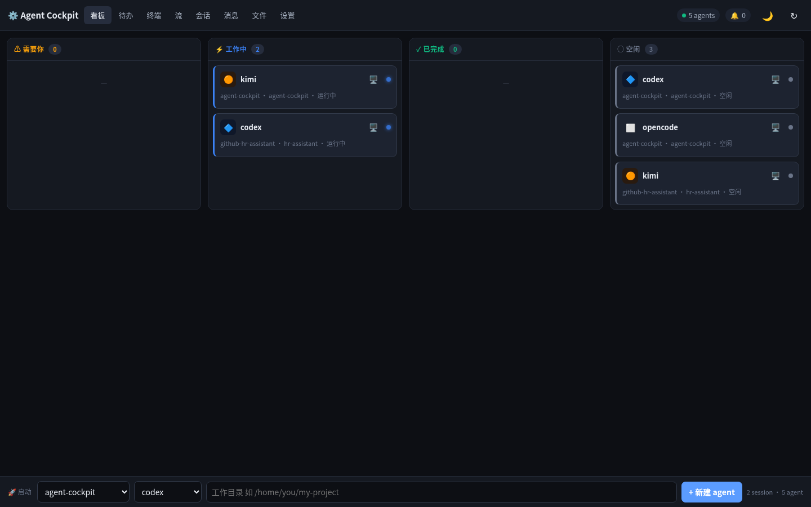
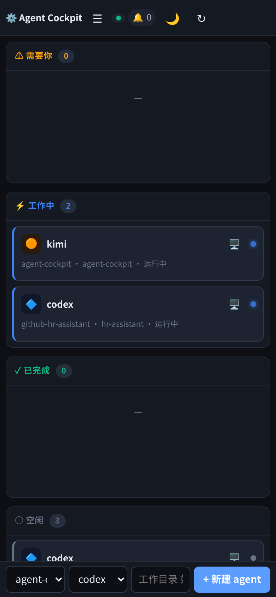

# Agent Cockpit

[](https://github.com/fyc0451/agent-cockpit/actions/workflows/test.yml)
[](LICENSE)
[](https://www.python.org/)

> 跑在浏览器里的 CLI 编码 agent 驾驶舱:配合 [herdr](https://herdr.dev) 使用,
> 一眼看清每个 agent 的状态,随时接管终端、发指令、传截图、跨 agent 协作——
> 电脑和手机浏览器都能用。

[English](README.en.md) | [日本語](README.ja.md)

<p align="center">
  
  
</p>

灵感来自 [Orca](https://onorca.dev) 的 Agent Dashboard,但做成轻量 Web 应用,
直接插进你现有的 herdr 会话。[Agent Mail](https://github.com/Dicklesworthstone/mcp_agent_mail)
集成是可选的,没装也不影响其他功能。

## 功能一览

- **看板** — 所有 herdr session 里的 coding agent(codex / kimi / claude / qoder / grok / opencode)按 *需要你 / 工作中 / 已完成 / 空闲* 实时分列。
- **真终端** — 点开任意 agent 卡片即可接管它的 TUI(xterm.js),发指令、跑命令、发特殊按键。
- **截图 → agent** — 上传图片自动转成 `@/path` 插入,让 agent 直接"看到"截图。
- **待办 Inbox** — 被卡住的 agent、失败的后台任务、待审 diff、Agent Mail 未读,汇成一条可操作的队列。
- **浏览器推送** — 在待办页开启 Web Push,点通知直达对应的 pane / 任务 / 消息。
- **agent 间消息** — 基于 Agent Mail:收发消息、已读确认;没装 Agent Mail 时消息页自动隐藏,其余功能不受影响。
- **文件浏览 + 编辑** — 白名单沙箱内浏览、编辑、下载、上传项目文件。
- **codex 后台任务** — 发起 `codex exec` 后台任务,流式看输出,审 diff,应用或stash 改动。
- **移动端友好** — 单文件前端自适应,支持拍照上传、触屏操作、PWA 加到主屏。
- **深色 / 浅色主题** — 头部一键切换并记住选择;浅色模式下终端里的显式深色(如 opencode 自带黑底)会自动反转成可读配色。

## 工作原理

```
浏览器(电脑 / 手机)
    │  局域网 / VPN(:8790)
    ▼
Agent Cockpit(FastAPI,与 herdr + hub 同机)
    ├── 只读 Agent Mail SQLite       (WAL 模式)
    ├── 经 Agent Mail hub MCP 写入   (发消息 / 已读)
    ├── 读 herdr socket(所有 session)(pane 状态 / 输出)
    └── 经 SSE 向浏览器推送状态与 diff
```

部署在**和 herdr 同一台机器**上,全部本地读取,零延迟;电脑和手机只是浏览器客户端。
Agent Mail 缺失时只隐藏消息相关视图;hub 暂时挂掉时消息只读,看板、终端、文件、任务、
待办、推送全部照常工作。

## 安装

### 依赖

| 依赖 | 用途 |
| --- | --- |
| [herdr](https://herdr.dev) | 本驾驶舱可视化/控制的 agent 会话 |
| [Agent Mail](https://github.com/Dicklesworthstone/mcp_agent_mail) hub(`:8765`,可选) | 待办与消息页里的跨 agent 消息 |
| `codex` CLI(已登录) | 后台 `codex exec` 任务 |
| Python 3.12+ | 运行时 |

### 一键安装

```bash
curl -fsSL https://raw.githubusercontent.com/fyc0451/agent-cockpit/main/install.sh | bash
```

安装器会克隆到 `~/agent-cockpit`、建虚拟环境、装依赖,并在有 systemd user bus 时
启用 `agent-cockpit.service`。启动失败先跑 `~/agent-cockpit/doctor.sh`。

### 手动安装

```bash
git clone https://github.com/fyc0451/agent-cockpit.git
cd agent-cockpit
python -m venv .venv
.venv/bin/pip install -r requirements.txt
.venv/bin/python server.py
# → http://localhost:8790
```

要从局域网/VPN 的其他设备访问:复制 `.env.example` 为 `.env`,设
`COCKPIT_HOST=0.0.0.0` 和一个随机的 `COCKPIT_TOKEN`。没有 token 时服务端拒绝
绑定非回环地址。

> **安全警告:** 远程访问请用 HTTPS 或 Tailscale Serve。裸 HTTP 会让登录
> cookie 暴露给同网段的任何人。不要把 Agent Cockpit 直接暴露到公网。

### systemd 服务

```bash
loginctl enable-linger "$USER"   # 注销后保持 user service 运行
cp agent-cockpit.service ~/.config/systemd/user/agent-cockpit.service
# 按你的环境改路径,然后:
systemctl --user daemon-reload
systemctl --user enable --now agent-cockpit
```

`KillMode=process` 保证重启驾驶舱不影响独立的 herdr 会话;但浏览器里新建的
PTY 终端会随重启断开,不要把它当持久任务用。

手动启动时记得先加载 `.env`:

```bash
set -a; source .env; set +a
.venv/bin/python server.py
```

## 首次使用(5 分钟上手)

1. 浏览器打开 `http://localhost:8790`。
2. 看板是空的很正常——点空态里的 **🚀 创建第一个工作区**(或「会话」页的
   **+ 一键工作区**),填 session 名、项目目录、要启动的 agent(如 `codex,kimi`),
   点启动。session 不存在会自动创建。
3. 回到「看板」,agent 按状态自动分列;点卡片看输出,点卡片上的 🖥 接管 TUI。
4. 「待办」页集中处理卡住 / 失败的 agent,可在此开启浏览器通知。
5. 遇到问题先看「设置 → 环境自检」:herdr、各 agent 可执行文件、Agent Mail
   哪个没就绪一目了然;命令行下也可以跑 `./doctor.sh`。

## 使用说明

### 看板

- 四列实时分列:**⚠ 需要你 / ⚡ 工作中 / ✓ 已完成 / ○ 空闲**。
- 点卡片进入该 pane 的「流」视图;点卡片右上角 **🖥** 直接接管 TUI。
- 底部 **🚀 启动栏**:选已有 session + agent 类型 + 工作目录,点 **+ 新建 agent**
  往 session 里加 agent;没有任何 session 时会自动引导你去建工作区。

### 待办

- 统一队列:被卡住等待输入的 agent、失败的后台任务、待审 diff、Agent Mail 未读。
- 点条目直达处理现场;点 **开启浏览器通知** 订阅 Web Push。
- 推送需要安全上下文:`https://`(如 Tailscale Serve)或 `http://localhost`。
  iPhone/iPad 必须先在 Safari 里 **分享 → 添加到主屏幕**,从主屏图标打开后再开通知
  (iOS 不允许普通 Safari 标签页订阅 Web Push)。

### 终端

- **+ 新终端** 开一个浏览器 PTY(随服务重启断开,勿存持久任务)。
- 工具栏:📎 上传(图片/文件自动插 `@/path`)、@协作(插入可联系的协作者信息)、
  🖥 herdr(attach 到 herdr session 分屏操作)、📜 返回流视图、📋 复制到剪贴板。
- herdr 分屏快捷键:`Ctrl-b` 切 pane / `d` 脱离 / `?` 全部快捷键。
- 手机上点 **⌨ 电脑键盘** 展开方向键 / Ctrl 组合键和可见输入框。

### 流(herdrflow)

- 每个 agent pane 一块:可滚屏、可复制的输出 + 底部输入框快速发指令。
- `prompt` 模式走 agent 的提示接口,`send` 模式直接模拟按键。
- 📋 把刚才在 Herdr TUI 里复制的文字填进输入框;⛶ 全屏专注单个工作区。

### 会话

- 列出所有 herdr session:干净重启 / resume 重启 pane、停止、删除已停止会话。
- **+ 一键工作区**:自动 建 session → 分屏 → 启动 agents;装了 Agent Mail 时
  还会注册身份并通知,另有 **📧 初始化通信** 一键开通 session 内全部 agent 身份。

### 消息

- 按项目/agent 浏览 Agent Mail 消息,可发消息、已读确认。
- Agent Mail 未安装或 hub 离线时自动降级:已有消息只读,其余功能不受影响。

### 文件

- 顶部的「可访问位置」是白名单根目录:系统目录 + 已注册项目 + 自定义目录。
  **＋ 添加目录** 可把任意目录加进白名单(只授权浏览,不移动数据)。
- 点目录下钻、点文件查看;文本文件可直接编辑保存,其他文件点 ⬇️ 下载。
- 搜索按文件名在当前目录及子目录递归匹配。
- **🚀 当前目录建工作区**:用文件列表当前目录预填一键工作区。

### 设置

- **界面语言**:中文 / English / 日本語;**外观配色**:深色 / 浅色(浅色模式下
  终端里 agent 自带的显式深色背景会自动做明度反转,opencode 黑底也能读)。
- **终端字体大小**:10–24,只影响本设备,立即生效。
- **每目录默认 agent**:启动栏填工作目录时自动预选对应 agent。
- **启用的 agent**:启动菜单只列勾选的类型。
- **运行参数**:上传上限、最大终端数、空闲终端回收时间、终端写超时。
- **环境自检**:herdr / 各 agent 可执行文件 / Agent Mail 的就绪状态,❌ 即未安装。

## 配置

环境变量见 `.env.example`:

| 变量 | 默认 | 说明 |
| --- | --- | --- |
| `COCKPIT_HOST` | `127.0.0.1` | 绑定地址 |
| `COCKPIT_PORT` | `8790` | 端口 |
| `COCKPIT_TOKEN` | 空 | 共享登录 token;非回环绑定时必填 |
| `HERDR_BIN` | 自动探测 | herdr 二进制路径 |
| `CODEX_BIN` | 自动探测 | codex 二进制路径 |
| `COCKPIT_VAPID_SUBJECT` | `mailto:agent-cockpit@localhost` | Web Push VAPID contact |
| `COCKPIT_VAPID_PRIVATE_KEY` / `PUBLIC_KEY` | 自动生成 | 多实例部署时可固定 VAPID 密钥对 |

hub token 自动从 `~/.agent-mail/client.env` 读取,不要硬编码。
VAPID 密钥首次生成于 `~/dashboard-data/`,不会进入仓库。
用户设置存在 `~/dashboard-data/settings.json`,终端字体等本机偏好存在浏览器
localStorage。

## 升级、诊断、卸载

```bash
./upgrade.sh       # 有本地改动时拒绝覆盖
./doctor.sh        # 检查 Python、依赖、herdr、Agent Mail、认证、服务
./uninstall.sh     # 只删 user service;代码、配置、数据保留
```

跑测试:`.venv/bin/pip install -r requirements-dev.txt && .venv/bin/pytest -q`

## 项目结构

```
agent-cockpit/
├── server.py              FastAPI 应用:路由、SSE、静态资源
├── db.py                  只读查询 hub 的 SQLite
├── herdr_client.py        多 session herdr CLI 封装(看板数据源)
├── tasks.py               codex exec 后台任务 + diff/apply
├── files.py               沙箱文件浏览/编辑
├── hub_client.py          MCP 写代理(发消息 / 已读)
├── web_push.py            VAPID 密钥、订阅与推送
├── uploads.py             文件/截图上传
├── settings.py            用户配置存储
├── terminal.py            浏览器 PTY 终端
├── static/index.html      单文件前端(看板 + 待办 + 终端 + 各标签页)
├── static/sw.js           Web Push service worker 与深链跳转
├── static/manifest.webmanifest  PWA 元数据
├── tests/                 回归与安全测试
├── install.sh / upgrade.sh / doctor.sh / uninstall.sh
└── agent-cockpit.service  systemd user 单元模板
```

## 为什么是驾驶舱而不是 CLI?

CLI agent(codex、kimi、qoder)各自强大却互相看不见。herdr 把它们放进可以
围观的 pane——但只能在那台机器的终端里看。Agent Cockpit 把这个本地终端视图
变成**网页驾驶舱**:躺在沙发上用手机就能看到哪个 agent 卡住等你,丢一张 bug
截图过去,让合适的 agent 接手。

## 限制

- **GUI agent(如 ZCode Desktop)无法上看板** — 本驾驶舱驱动的是 herdr 下的
  *终端* CLI agent,GUI 应用没有可编程控制面。
- **共享 token 认证** — 适合可信的个人局域网/VPN,不是多用户授权体系;
  请放在防火墙或私有网络之后。
- **传输安全** — HTTP 不保护会话 cookie,离开完全可信的网络请上 HTTPS 或
  Tailscale Serve。
- **Agent Mail 为可选集成** — 只读它的 SQLite,写入一律走 hub MCP API;
  缺失时仅消息类功能自动降级。

## 贡献与安全

开发说明见 [CONTRIBUTING.md](CONTRIBUTING.md);漏洞请按
[SECURITY.md](SECURITY.md) 私下报告(含部署威胁模型)。社区行为准则见
[CODE_OF_CONDUCT.md](CODE_OF_CONDUCT.md)。

## License

[MIT](LICENSE)
